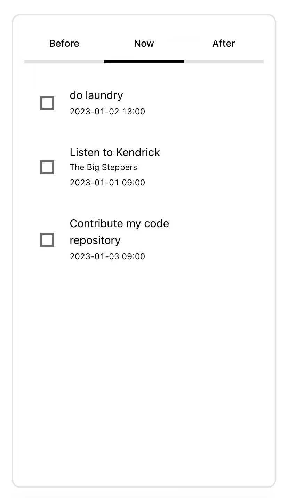

<h1 align="center">
  bna
</h1>

<p align="center">
  Before, Now & After
</p>

<p align="center">
  
</p>

<p align="center">
  Organize your work in a new timeline way.
</p>

## Getting Started

Try a live demo [here](https://biggbb777.github.io/bna/).

Install dependencies,

```bash
$ yarn
```

Start the dev server,

```bash
$ yarn start
```
